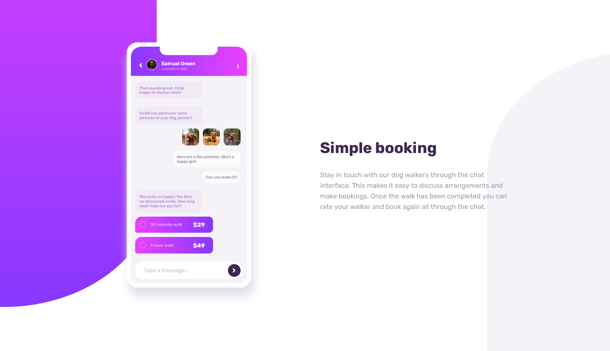

# Frontend Mentor - Chat app CSS illustration solution

This is a solution to the [Chat app CSS illustration challenge on Frontend Mentor](https://www.frontendmentor.io/challenges/chat-app-css-illustration-O5auMkFqY).

## Table of contents

- [Overview](#overview)
  - [The challenge](#the-challenge)
  - [Screenshot](#screenshot)
  - [Links](#links)
- [My process](#my-process)
  - [Built with](#built-with)
  - [What I learned](#what-i-learned)
  - [Continued development](#continued-development)
  - [Useful resources](#useful-resources)
- [Author](#author)
- [Acknowledgments](#acknowledgments)

## Overview

### The challenge

Users should be able to:

- View the optimal layout for the component depending on their device's screen size

### Screenshot



### Links

- Solution URL: [Solution URL here](https://www.frontendmentor.io/solutions/chat-app-css-illustration-solution-r27o0Gru6)
- Live Site URL: [Live site URL here](https://prj-07-chat-app-css-illustration.vercel.app/)

## My process

### Built with

- Semantic HTML5 markup
- CSS custom properties
- Flexbox
- CSS Grid
- Mobile-first workflow

### What I learned

To see how you can add code snippets, see below:

```html
    <script
      src="https://kit.fontawesome.com/32f374c92f.js"
      crossorigin="anonymous"
    ></script>
    <link rel="preconnect" href="https://fonts.googleapis.com" />
    <link rel="preconnect" href="https://fonts.gstatic.com" crossorigin />
    <link
      href="https://fonts.googleapis.com/css2?family=Rubik:wght@400;500;700&display=swap"
      rel="stylesheet"
    />
    <link rel="stylesheet" href="style.css" />
```
Multiple background images:
```css
body {
  font-size: 16px;
  font-family: "Rubik", sans-serif;
  background-color: var(--Light-Grayish-Violet);
  background: url("/images/purple-rectangle.svg"), url("/images/gray-rect.svg");
  background-repeat: no-repeat, no-repeat;
  background-size: 250%, 250%;
  background-position: top -250px left -280px, top 450px left 200px;
}
```
How to create linear gradient:
```css
    background: linear-gradient(
    to right,
    var(--Light-Violet),
    var(--Light-Magenta)
  );
```
How to use border radius with different number:
```css
  border-top-right-radius: 10px;
  border-bottom-right-radius: 10px;
  border-top-left-radius: 15px;
  border-bottom-left-radius: 5px;
```
How to create svg image for background with rx and ry attributes:
```css
  <svg viewBox="0 0 1000 1000" xmlns="http://www.w3.org/2000/svg">
    <rect x="0" y="50" width="500" height="800" rx="300" ry="200" fill="hsl(270, 20%, 96%)"/>
</svg>
```
### Continued development

Many few projects ahead I will try Tailwindcss and Vite.js.

### Useful resources

- [SVG Gradients - Linear](https://www.w3schools.com/graphics/svg_grad_linear.asp) - This helped me to add gradients to background image.
- [rx and ry attributes](https://developer.mozilla.org/en-US/docs/Web/SVG/Attribute/rx) - This is an amazing article which helped me finally understand how to create the shapes used for background images using rx and ry attributes.

## Author

- Website - [Gustavo Sanchez](https://www.gusanche.dev)
- Frontend Mentor - [@gusanchedev](https://www.frontendmentor.io/profile/gusanchedev)
- Github - [@gusanchedev](https://www.github.com/gusanchedev)
- Twitter - [@gusanchedev](https://www.twitter.com/gusanchedev)
- Linkedin - [gusanchedev](https://www.linkedin.com/in/gusanchedev/)

## Acknowledgments

Thanks to Mariapaz for being my friend and support 💙
